# DMARK To-Do List - Full-Stack десктопное приложение (ТЗ)

Полноценное **Full-Stack** приложение (Frontend/Desktop + Backend) для списка задач.  
Проект выполнен как **тестовое задание для DMARK,** чтобы попасть на стажировку.

- **Backend:** Go (Clean Architecture), PostgreSQL, Docker/Docker Compose
- **Frontend:** React (Vite, React Router), Tailwind CSS
- **Desktop:** Wails v2 (обёртка SPA в нативное окно)

---

## 📂 Структура проекта
 
```text
.
├── client/      # фронтенд (SPA на React)
├── server/      # бэкенд (Go API + Postgres)
├── .gitignore   # игнорировать файлы, которые не должны отслеживаться репозиторием
└── README.md    # этот файл (стек технологий, чек-лист поставленных задач)
```

---

## ⚙️ Чеклист (список заданий из ТЗ)

### 1) Интерфейс пользователя — **25 баллов**
**Обязательное (15)**
- [x] Текстовое поле для ввода новой задачи
- [x] Кнопка добавления задачи
- [x] Отображение списка всех задач
- [x] Базовая стилизация (CSS/Tailwind)
- [x] Визуальное различие выполненных/невыполненных задач

**Бонус (10)**
- [x] Адаптивная вёрстка (масштаб окна)
- [x] Переключение светлой/тёмной темы

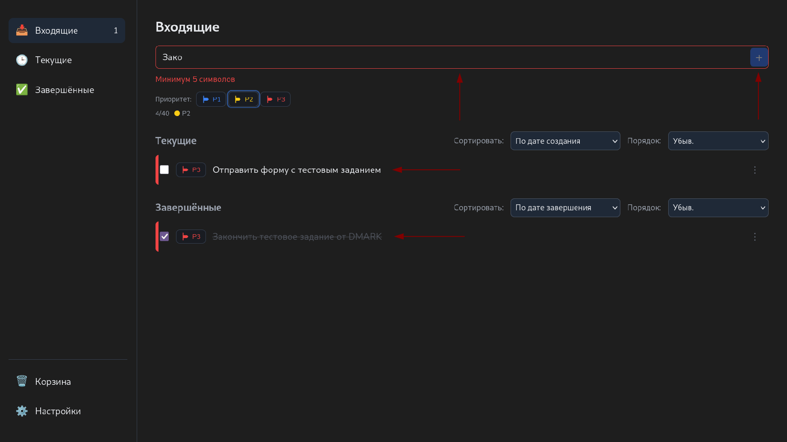

### 2) Добавление задач — **20 баллов**
**Обязательное (10)**
- [x] Добавление новой задачи в список
- [x] Валидация ввода (запрет пустой строки)

**Бонус (10)**
- [ ] Дата/время выполнения (due date)
- [x] Установка приоритета (низкий/средний/высокий)

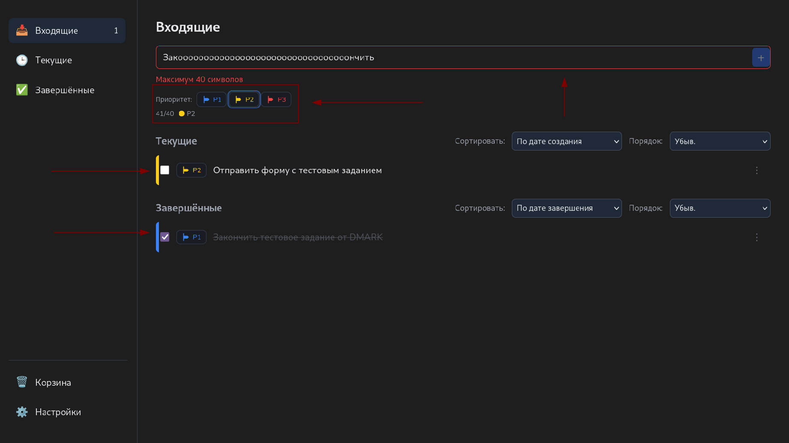

### 3) Удаление задач — **15 баллов**
**Обязательное (5)**
- [x] Удаление задачи из списка

**Бонус (10)**
- [x] Подтверждение удаления (модальное окно)

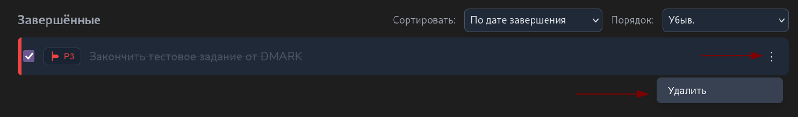
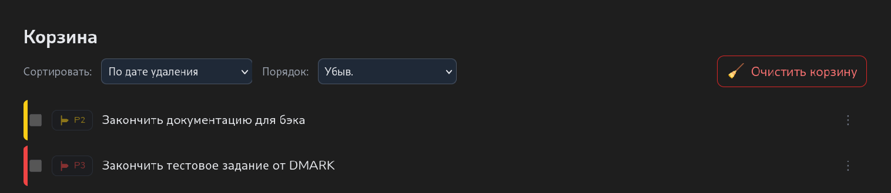
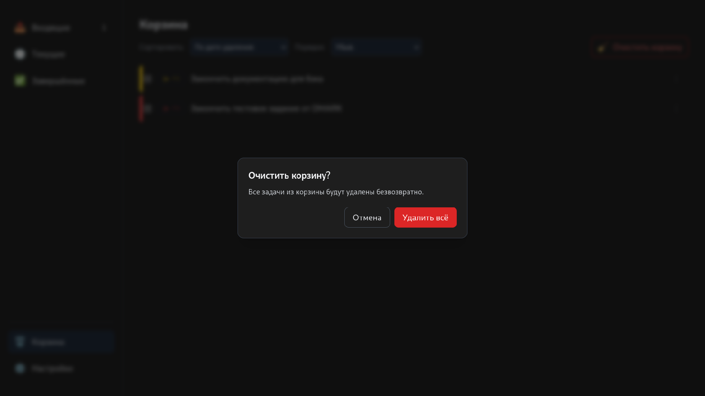

### 4) Управление выполнением — **30 баллов**
**Обязательное (10)**
- [x] Отметка задачи как выполненной
- [x] Визуальное оформление выполненных (напр., зачёркивание)

**Бонус (20)**
- [x] Отдельный раздел «Выполненные задачи»
- [x] Отмена выполнения (возврат в «Активные задачи»)

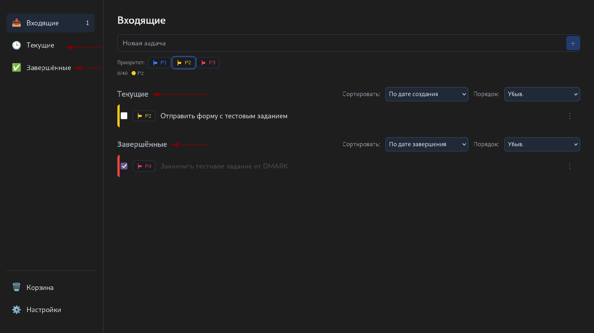
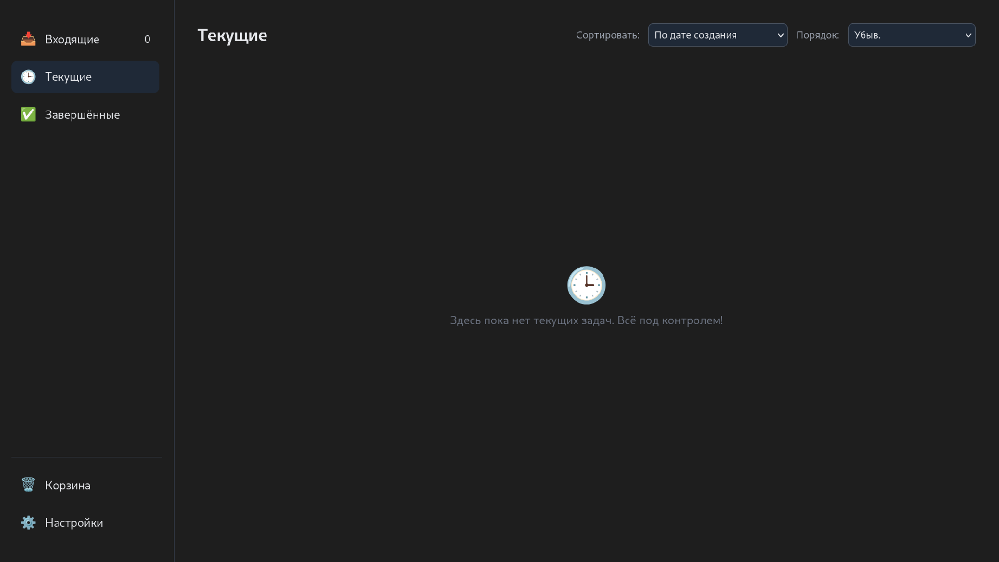
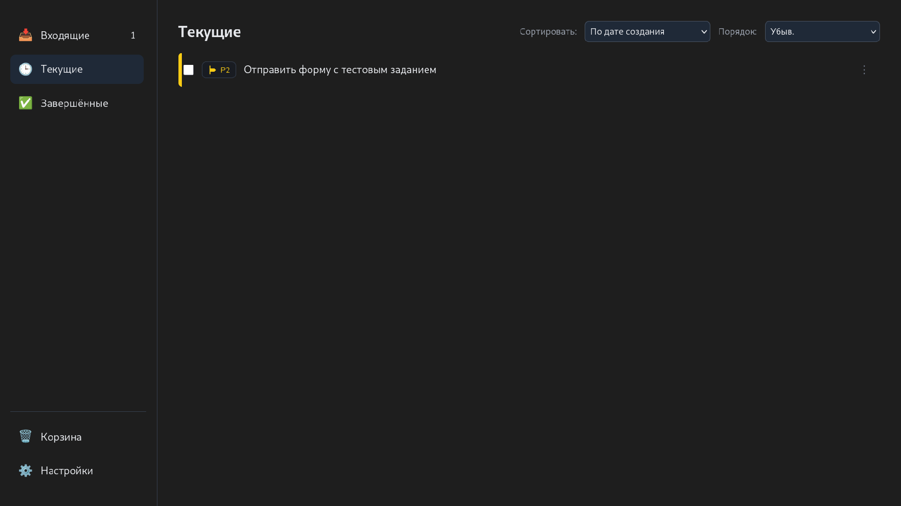
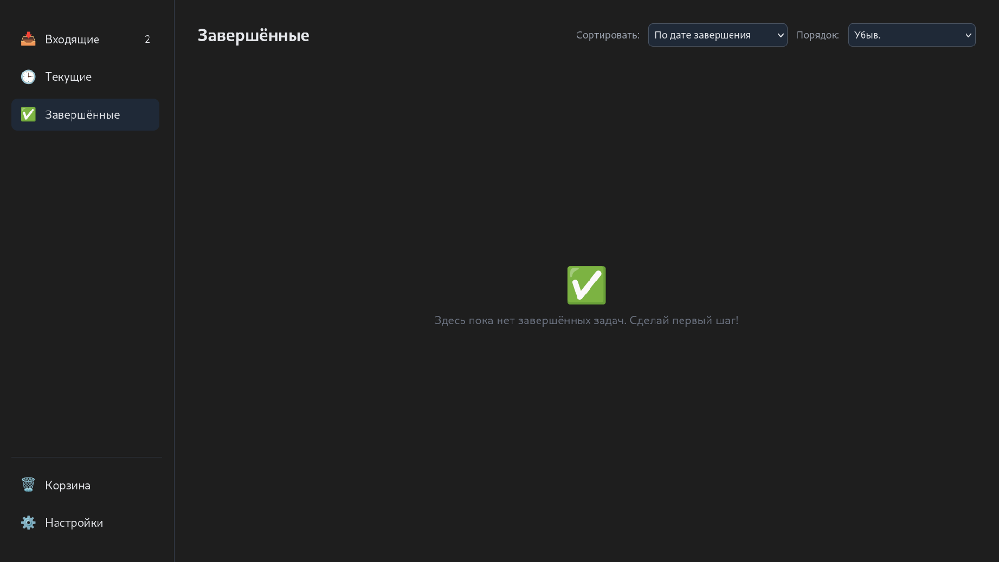
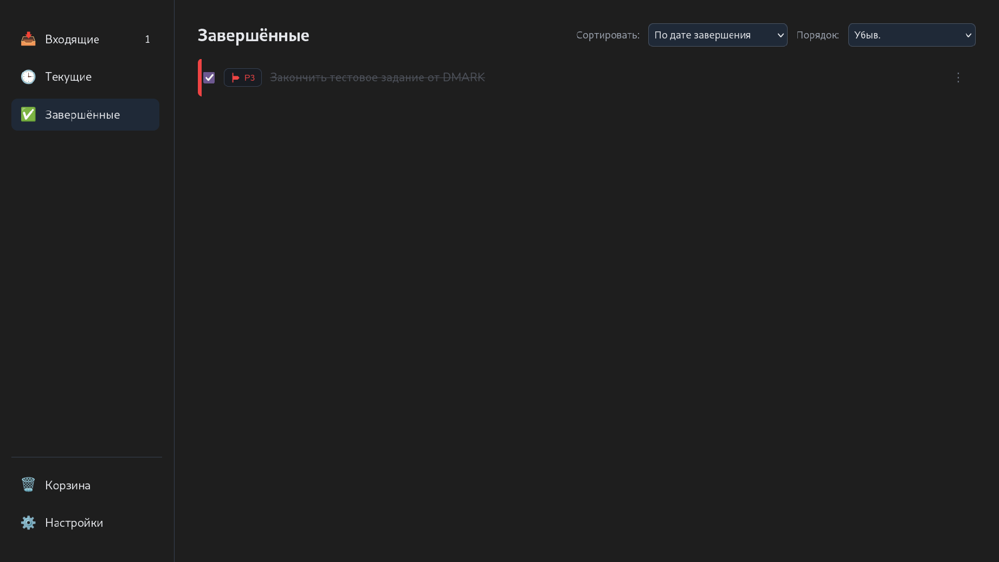

### 5) Сохранение состояния — **50 баллов**
**Обязательное (20)**
- [x] Сохранение состояния задач при закрытии приложения
- [x] Загрузка состояния при запуске

**Бонус (30)**
- [x] Хранение в PostgreSQL
- [x] Слои repo → service → usecase (Clean Architecture)

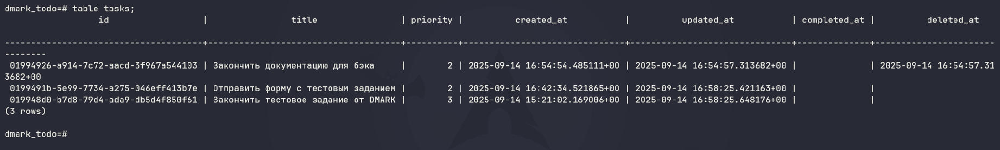
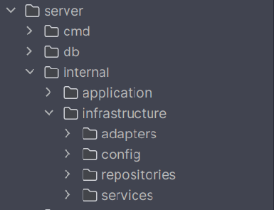

### 6) Фильтрация и сортировка — **20 баллов**
**Обязательное (10)**
- [x] Фильтр по статусу (все / активные / выполненные)
- [x] Сортировка по дате добавления

**Бонус (10)**
- [x] Сортировка по приоритету
- [ ] Фильтр по дате (сегодня / на неделю / просроченные)
 
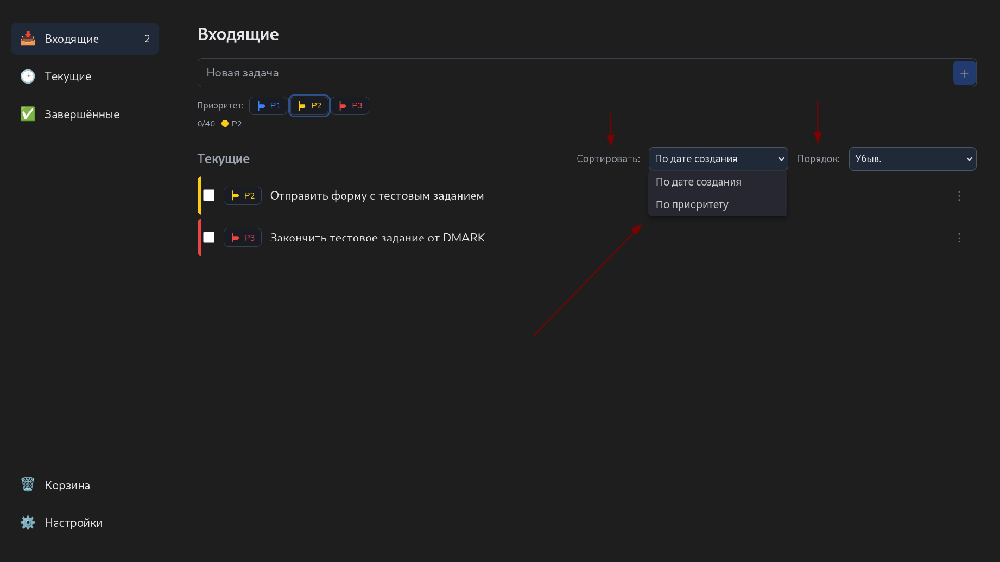

---

### 🧮 Итого
- База: **60/60 баллов**
- Бонус: **90/100 баллов**
- **В общем: 150/160 баллов**

P.S Надеюсь все сделал правильно)