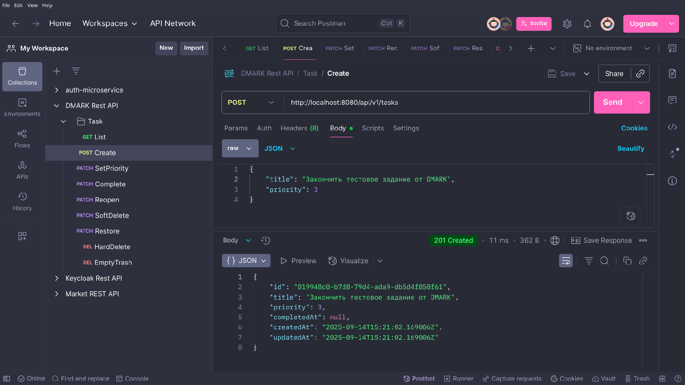
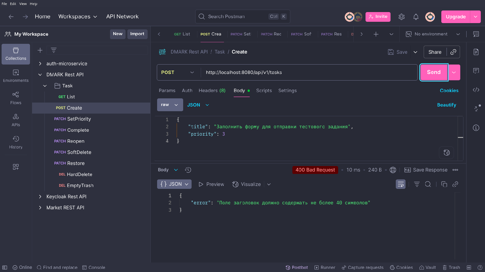
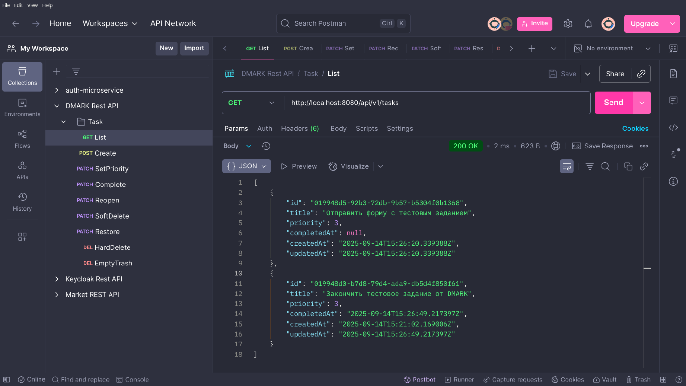
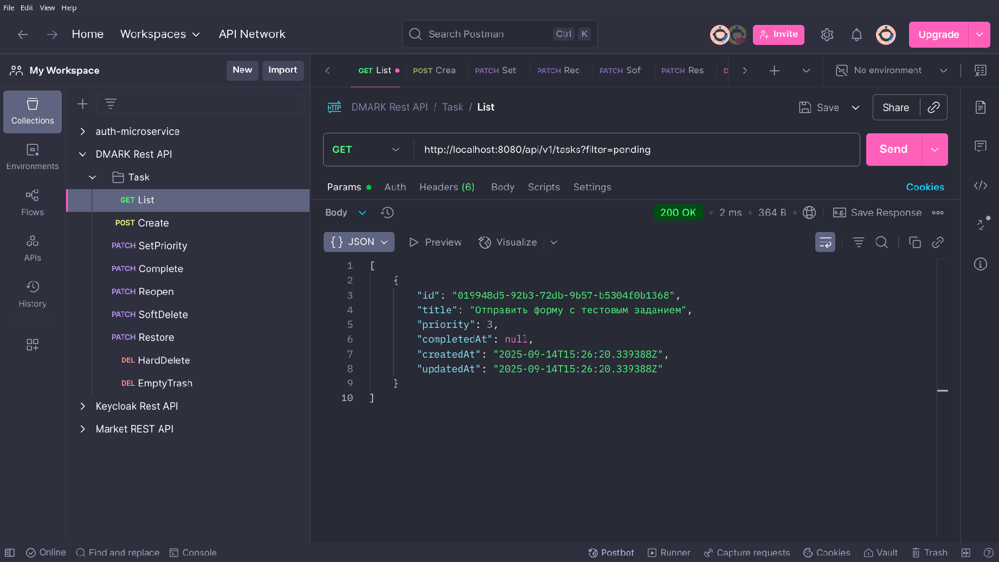
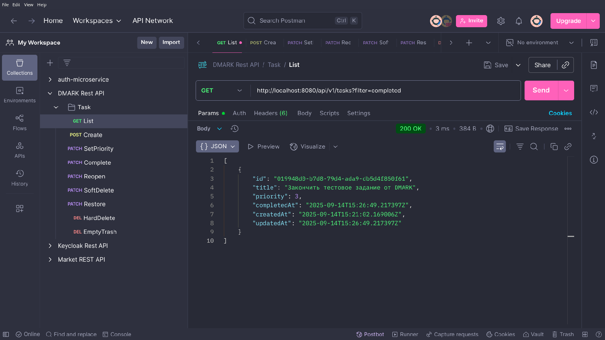
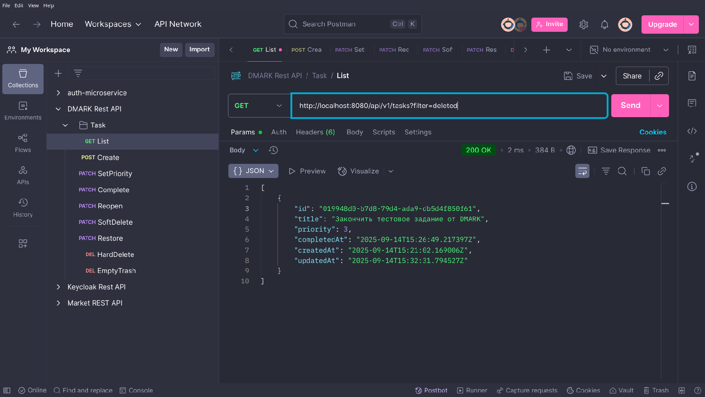
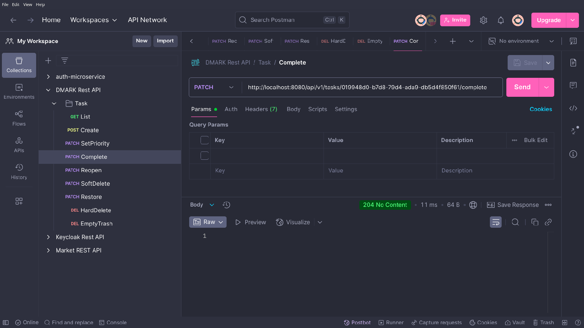
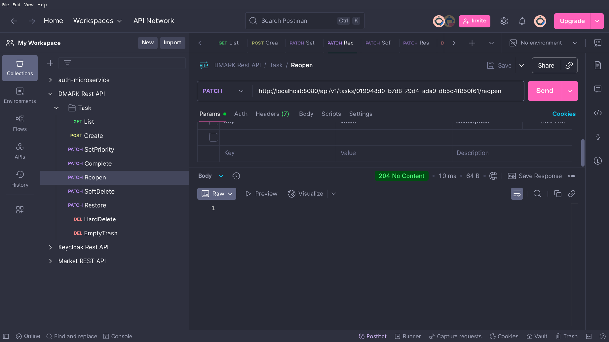
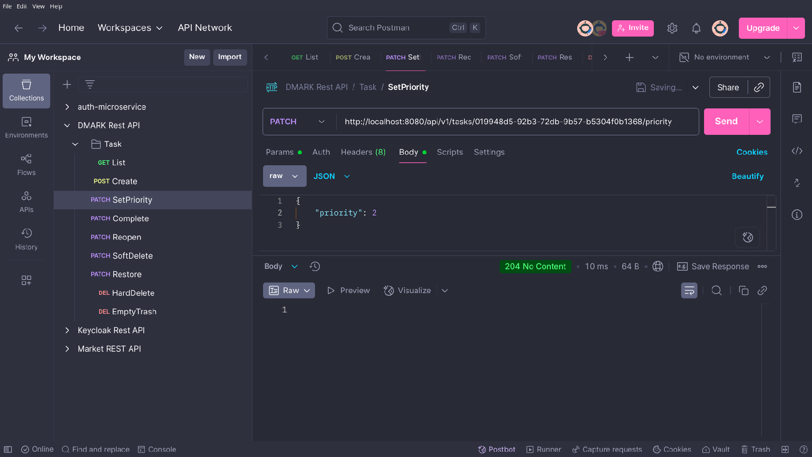
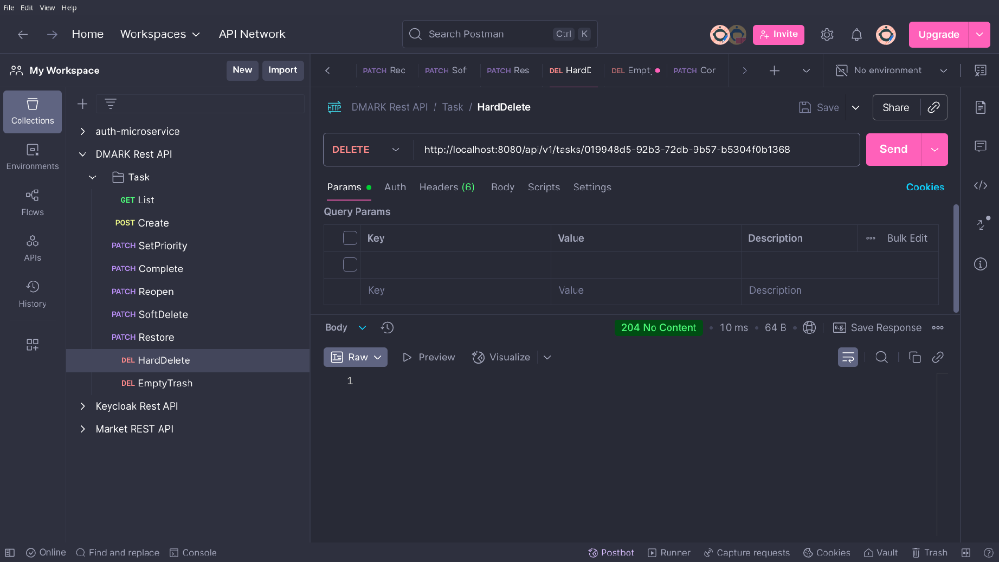

# DMARK To-Do List - Backend (API)

Back-End для приложения To-Do List, построенный с использованием Clean Architecture на Go.

---

## ✨ Фичи

- Создание задачи (c валидацией входных данных)
- Установка приоритета задачи (`3=High`, `2=Medium` (по умолчанию), `1=Low`)
- Получение списка задач с параметрами:
    - `filter`: `pending` / `completed` / `deleted`
    - `sort`: `created_at` / `priority / `completed_at` / `deleted_at`
    - `order`: `asc` / `desc` (по умолчанию desc)
- Фильтрация (`pending/completed/trashed/inbox`), поиск, сортировка
- Мягкое удаление (корзина) и восстановление

---

## 🛠 Технический стек

- **Язык:** Go
- **База данных:** PostgreSQL
- **Контейнеризация:** Docker, docker-compose

## 🏗️ Архитектура

Проект следует принципам **Clean Architecture** с четким разделением слоев:

```
.
├── cmd/server                                    # точка входа приложения
│   └── main.go                                   # запуск DI, HTTP и сервера
├── internal
│   ├── application
│   │   ├── domain                                # бизнес-модели и правила
│   │   │   └── task.go                           # сущность Task + инварианты
│   │   └── ports                                 # контракты (интерфейсы)
│   │       ├── task_repository.go                # интерфейс TaskRepository
│   │       └── task_service.go                   # интерфейс TaskService
│   └── infrastructure
│       ├── adapters
│       │   ├── database                          # адаптер БД
│       │   │   └── postgres.go                   # подключение к Postgres (dsn, pool)
│       │   └── http                              # HTTP-транспорт
│       │       ├── dto/task_dto.go               # DTO и маппинг Domain ↔ JSON
│       │       ├── handlers/task_handler.go      # HTTP-хендлеры /api/v1/tasks
│       │       └── init.go                       # маршруты и инициализация HTTP
│       ├── config                                # работа с конфигом
│       │   └── config.go                         # загрузка/валидация настроек
│       ├── repositories                          # реализации портов
│       │   ├── sqlc                              # сгенерированный код sqlc
│       │   │   ├── db.go                         # инициализация sqlc-клиента
│       │   │   ├── models.go                     # модели sqlc
│       │   │   └── tasks.sql.go                  # методы по tasks (sqlc)
│       │   └── task_repository.go                # реализация TaskRepository (Postgres)
│       └── services                             
│           └── task_service.go                   # реализация TaskService (use-cases)
├── db
│   ├── migrations
│   │   └── 00001_create_tasks_table.sql          # миграция таблицы tasks
│   └── queries
│       └── tasks.sql                             # SQL для генерации sqlc
├── pkg
│   ├── httphelpers
│   │   └── params.go                             # парсинг query: limit/offset/sort/order
│   └── validator
│       └── translate.go                          # тексты ошибок валидации/локализация
├── config.yaml                                   # настройки сервера/БД/CORS/пагинации
├── docker-compose.yaml                           # окружение dev: Postgres + API
├── Dockerfile                                    # сборка контейнера API
├── go.mod                                        # модуль и зависимости Go
├── go.sum                                        # контрольные суммы зависимостей
├── Makefile                                      # удобные цели: up/build/down/clean/logs/ps/help
├── README.md                                     # краткая документация проекта
└── sqlc.yaml                                     # конфиг генератора sqlc
```

**Слои кратко:**
- **Adapters** — транспорт и база данных (HTTP: DTO/handlers/routes; DB-адаптер).
- **Ports** — контракты: интерфейсы `TaskService` и `TaskRepository`. Описывают методы для реализации.
- **Services** — реализация `TaskService`; use-cases, вызовы доменных методов, координация с репозиториями.
- **Repositories** — реализация `TaskRepository` поверх Postgres/sqlc; маппинг Domain ↔ SQL.
- **Domain** — бизнес-модели (сущности).

---

## 📝 Принципы Clean Architecture

1. **Независимость от фреймворков** - Бизнес-логика не зависит от Fiber
2. **Тестируемость** - Каждый слой можно тестировать независимо
3. **Независимость от БД** - Легко сменить SQLite на PostgreSQL
4. **Независимость от внешних сервисов** - Все зависимости изолированы

---

## 🔄 Dependency Injection

Композиция зависимостей выполняется в `cmd/server/main.go` и `infrastructure/adapters/http/init.go`:

1. Создаём подключение к БД (`adapters/database/postgres.go`).
2. Инициализируем реализацию репозитория (`infrastructure/repositories/...`), соответствующую `ports.TaskRepository`.
3. Создаём сервис (`infrastructure/services/task_service.go`), реализующий `ports.TaskService`.
4. Прокидываем сервис в HTTP-слой (handlers), не протягивая инфраструктурные типы внутрь домена.

> Такой порядок позволяет подменять репозиторий (например, на in-memory) и повторно использовать доменную логику.

---

## 🔧 Конфигурация

### 1. `config.yaml` (пример)
```yaml
server:
  http_port: 8080                # порт, на котором слушает API
postgres:
  host: postgres                 # хост БД (имя сервиса в docker-compose)
  port: 5432                     # порт PostgreSQL
  user: ${POSTGRES_USER}         # пользователь БД (из переменных окружения)
  password: ${POSTGRES_PASSWORD} # пароль БД (из переменных окружения)
  db: dmark_todo                 # имя базы данных
  sslmode: disable               # режим SSL для подключения
```

### 2. `.env.example` (пример)
```.env
# ─────────────────────────────────────────────────────────────
# PostgreSQL
# ─────────────────────────────────────────────────────────────
POSTGRES_USER=postgres           # дефолтный пользователь PostgreSQL
POSTGRES_PASSWORD=change_me      # укажи свой пароль от БД
POSTGRES_DB=dmark_todo           # название базы данных
POSTGRES_PORT=5432               # порт PostgreSQL
```

---

## 📚 API Endpoints (v1)

**Base URL (local):** `http://localhost:8080/api/v1`

### Модель `Task` (HTTP)
```json
{
  "id": "uuid",
  "title": "string",
  "priority": 2,
  "created_at": "RFC3339",
  "updated_at": "RFC3339",
  "completed_at": "RFC3339|null",
  "deleted_at": "RFC3339|null"
}
```

### Ручки:
- **Создать задачу**
    - `POST /tasks`
    - Body:
      ```json
      { "title": "Закончить тестовое задание от DMARK", "priority": 3 }
      ```
    - 201 → `Task`
    - 
    - 400 → `Task` (желательно ошибку 422 здесь)
    - 

- **Список задач**
    - `GET /tasks`
    - Query:
        - `filter` — `pending` | `completed` | `trashed` | `inbox` (по умолчанию — активные)
        - `sort` — `created_at` | `updated_at` | `priority`
        - `order` — `asc` | `desc` (по умолчанию `desc`)
    - 200 → `Task[]`
  - 
  - 
  - 
  - 

- **Завершить задачу**
    - `PATCH /tasks/:id/complete`
    - 204 → no content
    - 

- **Вернуть в «незавершённые»**
    - `PATCH /tasks/:id/reopen`
    - 204 → no content
    - 

- **Поместить в корзину**
    - `PATCH /tasks/:id/trash`
    - 204 → no content
    - 

- **Восстановить из корзины**
    - `PATCH /tasks/:id/restore`
    - 204 → no content
    - 

- **Изменить приоритет**
    - `PATCH /tasks/:id/priority`
    - Body:
      ```json
      { "priority": 2 }
      ```
    - 204 → no content
  - 

- **Удалить навсегда**
    - `DELETE /tasks/:id`
    - 204 → no content
    - 

---

## ⚠️ Требования

- Для запуска **бэкенда обязателен Docker** (и Docker Compose).

---

## 🧰 Makefile — команды

- `make up` — запустить сервисы (используя уже собранные образы).
- `make build` — собрать образы.
- `make up-build` — **собрать и запустить** (удобно для первого старта).
- `make down` — остановить все сервисы.
- `make clean` — полностью очистить окружение (контейнеры/сети/тома).
- `make logs` — показать логи сервиса (по умолчанию: `api`; можно так: `make logs service=db`).
- `make ps` — список сервисов и их статус.
- `make help` — краткая справка по доступным командам.

### Быстрый старт
```bash
# 1) собрать и запустить
make up-build

# 2) смотреть логи API (Ctrl+C для выхода)
make logs

# 3) посмотреть запущенные контейнеры
make ps

# 4) остановить окружение
make down
```
